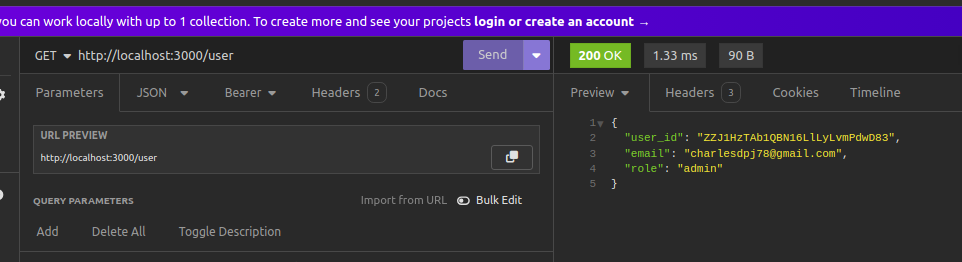

# Fire-Go-Auth: Setting up Firebase authentication and RBAC in Go


## Overview

Authentication is really important for any app that wants to keep users data safe. Security and the protection of users' information is utmost priority. There are different methods for handling authentication, but for this particular case, we'll be focusing  on using a third-party identity platform.


The authentication process is quite simple. When a user tries to sign in, the client (web or mobile) sends a request to the Firebase server. the firebase server returns an id_token. In this case, the token is configured to be JWT. Theid_token is used by the client to know if a user is authenticated. The id_token is also used to authenticate API calls made to backend APIs. We use the authentication flow here.


## Article
I recommend checking out this article for a detailed walkthrough of the setup process. It has everything you need to know to understand and implement each step effectively.

[Setting up Firebase authentication and RBAC in Go](https://medium.com/@charlesdpj78/building-simple-modern-go-apps-kiss-pattern-with-go-firebase-sqlite-3b6803ddcba4)


## Getting Started

To get started with this project, follow these steps:

1. **Clone the git repo**: 
``` yaml
git clone https://github.com/Cprime50/fire-go-auth.git
```

2. **Set Up Firebase Project**: Create a new Firebase project or use an existing one in your [firebase console](https://console.firebase.google.com)

3. **Install the Go dependencys**: cd into project folder and run
```yaml
go mod tidy
```


6. **Obtain Your Firebase Private Key**:
   - Navigate to the Firebase Console, under project settings, service accounts and download your project's private key.
   - For security, store this key in a `.env` file.


7. **Create a `.env` File**:
   - In the root directory of the project, create a `.env` file.
   - Add the following details to the `.env` file:

``` yaml
ADMIN_EMAIL= youremail@mail.com

PORT=:3000

FIREBASE_KEY= your_private_key.json
```

Replace `youremail@mail.com` with your `admin email`, and `path/to/your_private_key.json` with the path to your Firebase private key.

- **Admin Email**: This email will be set as the default admin when authenticated


8. **Configure Your Client Application And Make a Request To The Server:**
Setup your client to use firebase to authenticate users

After a user is authenticated, you send their access token to the server to authenticate each request. This is typically done by including the ID token in the Authorization header of your HTTP requests.


example:
``` javascript
function sendTokenToServer(accessToken) {
    fetch('localhost:3000/user', {
        method: 'GET',
        headers: {
            'Authorization': 'Bearer ' + accessToken
        }
    }).then(response => {
    }).catch(error => {
        console.error('Error:', error);
    });
}
```



## Contributing

Contributions are welcome! If you have suggestions for improvements or encounter any issues, please feel free to open an issue or submit a pull request.
